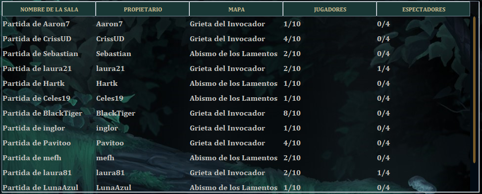

# Actividad # 10 - Tablas
## Josue Nuñez Prada

En esta actividad se crea y hace uso una tabla, trayendo los datos desde un servicio logico (PartidasService).
La tabla contiene datos de las partidas personalizadas disponibles en el momento, cada partida tiene un nombre, propietario, mapa, numero de jugadores y numero de expectadores.

La tabla esta ubicada en la pestana UNIRSE A PARTIDA PERSONALIZADA de la pestana Jugar. En el panel de la tabla hay un JText que nos permite hacer un filtrado, un boton para recargar y dos checks de filtrado.

Este repositorio contiene el codigo de la decima actividad, correspondiente al uso-configuracion de tablas y servicios logicos.
